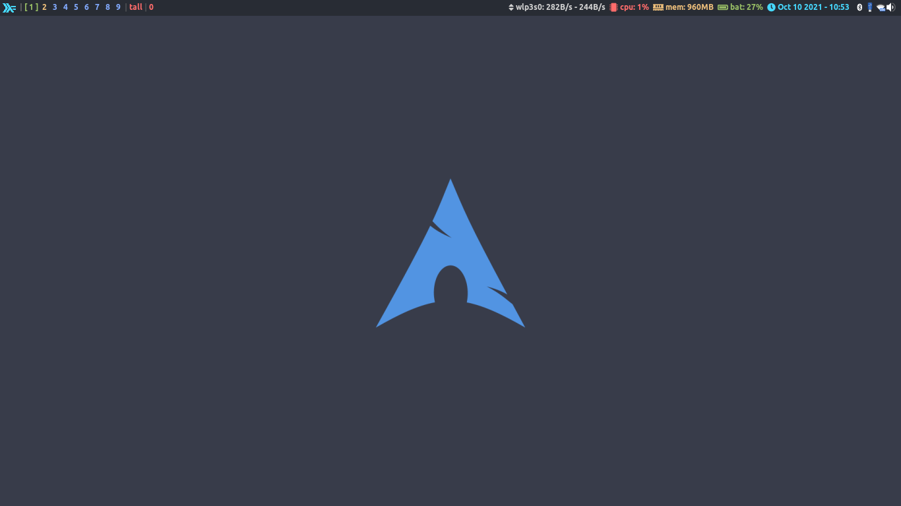
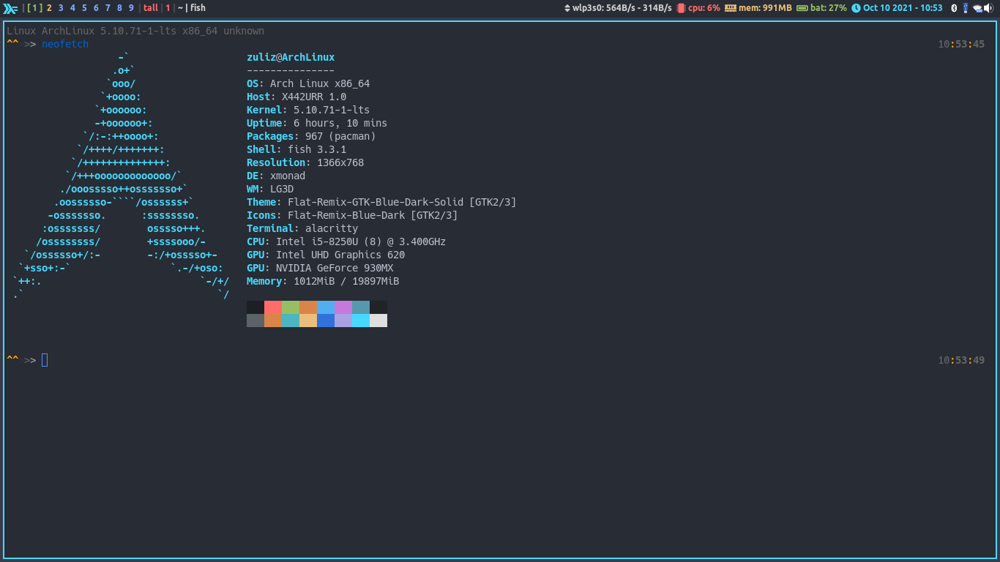
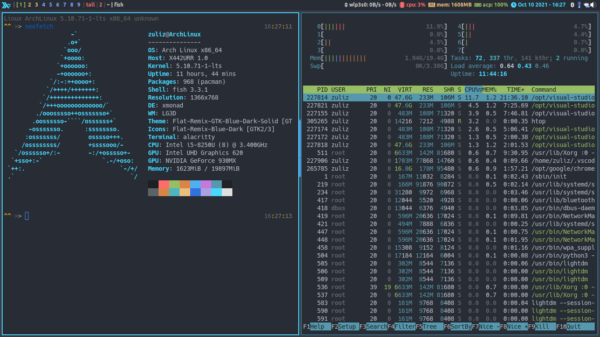
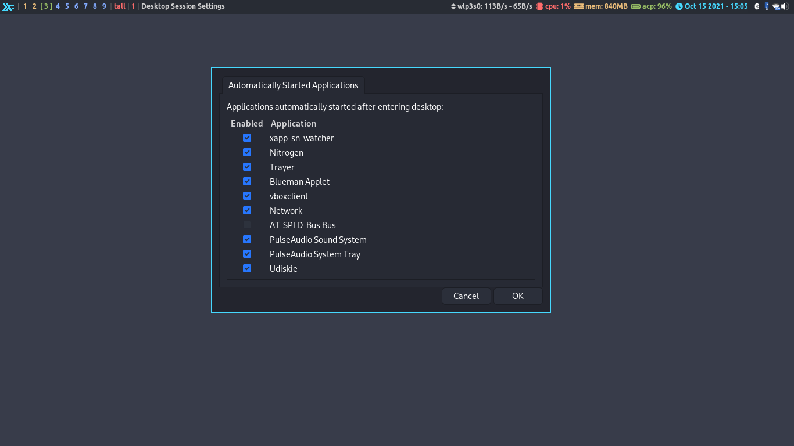

# xmonad-dotfiles
Just my ugly (but efficient) xmonad setup for daily driver

In case: I use Arch BTW 🤭
and also work for all linux distro with xmonad installed.

Minimum:
1.  xmonad 0.17.0+

Needed :
1.  xorg -> display server
2.  xmonad -> yeah you must install this
3.  xmonad-contrib -> more libs for xmonad
4.  xmonad-utils -> xmonad utilities
5.  xmobar -> panel / status bar

Attributes (used for this config and must be installed):
1.  trayer -> system tray
2.  brightnessctl -> control monitor brightness
3.  pactl -> audio volume control
4.  pulseaudio -> audio server
5.  nm-applet -> Network manager applet.
6.  blueman-applet -> bluetooth manager applet.
7.  volumeicon -> audio/volume icon system tray
8.  nitrogen -> wallpaper manager
9.  udiskie -> usb auto mounter with system tray support
10. alacritty -> my favorite terminal
11. Ubuntu font, Awesome font, Mononoki font, google-font(optional) -> font collection
12. rofi -> replacement for dmenu. what ?, this is app launcher menu. to change theme, execute command: "rofi-theme-selector" > enter selected theme (preview) > "Alt + a" to apply or "Esc" to cancel.
13. scrot -> screenshot program
14. lxsession -> i have benefit features from this program like: polkit (gvfs: android-mtp, apple-mobile-device, volume mounter and more), auto start support xdg desktop files (/etc/xdg/autostart and ~/.config/autostart) many application use this like virtualbox daemon, etc. i customize the auto start program like nitrogen,trayer and udiskie to ~/.config/autostart. so you no need to edit and recompile again the xmonad.hs. you can add more autostart (.desktop) program to this folder if you needed and enable/disable in Desktop Session Settings
15. rofi-emoji -> emoji support in rofi style

Optional (not a part of this config):
1. neovim (text editor terminal)
2. thunar (xfce4 file-manager)
3. gvfs (gnome virtual filesystem thunar plugin)
4. gvfs-afc (apple/ios virtual filesystem thunar plugin)
5. gvfs-mtp (android virtual filesystem thunar plugin)
6. lightdm (display manager)
7. many more...

Key Bindings:
super = Super key (windows key)
1.  super + enter               -> open terminal
2.  super + p                   -> open rofi (app menu)
3.  super + f                   -> change layout to floating mode
4.  super + w                   -> change layout to wide accordion mode
5.  super + -                   -> switch to prev workspace
6.  super + =                   -> switch to next workspace
7.  super + m                   -> focus to master window
8.  super + j                   -> focus to down window
9.  super + k                   -> focus to up window
10. super + h                   -> shrink focused window
11. super + l                   -> expand focused window
12. super + 1-9                 -> switch to another workspace
13. super + f1-f3               -> switch screen workspace for multi monitor
14. super + space               -> full screen for focused window, use this for watch movie
15. super + t                   -> revert back focused floating (mouse drag/resize) window to tile (tall)
16. super + \[ (bracket left)   -> decrease window spacing
17. super + \] (bracket_right)  -> increase window spacing
18. super + shift + a           -> close all window in current workspace
19. super + shift + c           -> close focused window
20. super + shift + q           -> close xmonad (if use Display Manager this action for logout)
21. super + shift + r           -> restart xmonad on the fly
22. super + shift + space       -> reset layout mode
23. super + shift + t           -> revert back all floating (mouse drag/resize) windows to tile (tall)
24. super + shift + j           -> swapping down focused window (move down)
25. super + shift + k           -> swapping up focused window (move up)
26. super + shift + -           -> move focused window to prev workspace
27. super + shift + =           -> move focused window to next workspace
28. super + shift + 1-9         -> move focused window to another workspace
29. super + shift + f1-f3       -> move focused window to another screen workspace (for multi monitor)
30. esc                         -> cancel action
31. enter                       -> select action
32. audio_mute                  -> mute audio
33. audio_raise                 -> increase audio volume
34. audio_lower                 -> decrease audio volume
35. brightness_up               -> increase brightness display
36. brightness_down             -> decrease brightness display
37. super + prt_scr             -> take screenshot
38. super + e                   -> rofi emoji
39. super + g                   -> change layout to grid mode
40. super + shift               -> rofi-pass (pass manager)

Mouse Bindings:
super = Super Key (Windows Key)
1. super + left click               -> move window
2. super + right click              -> Resize window Left,Right,Up,Down
3. super + shift + right click      -> Resize window Right,Down

NOTE:
1. Xmonad Config and stuff in: ~/.xmonad, Xmobar config: ~/.xmonad/xmobar/xmobarrc
2. This config set Menu key as Super_R key, because in my keyboard layout only have Left Super key (Super_L). i don't need the Menu key, so i remap this key. See xmonad.hs at line #70: spawnOnce "xmodmap -e \"keysym Menu = Super_R\"" , you can delete this line if you not used my key map.
3. Please change /home/zuliz to /home/your_user directory in xmobarrc at lines #18 & #21, or xmobar will broken.
4. if you just follow my config please install required Attributes software above.
5. all changed in xmonad.hs mustbe recompiled, use cmd: xmonad --recompile. then restart your xmonad or re-login.
6. all auto start program moved to ~/config/autostart/*.desktop files since i use lxsession, you can add/edit/remove if you want and make sure your enabled by cheking in "Desktop Session Settings"
7. i use this config without any Desktop Environtment (DE) installed in my system, so becarefull if you using my config with alongside DE. why ? some parts program like lxsession originaly from LXDE and all DE have independently program like their own session manager.
8. xmonad/xmobar can't start/crashing after haskell module upgrade, login to tty (alt+ctrl+f(1,2,3,..)) then login at normal user and type this: 1. sudo ghc-pkg recache<enter> 2. xmonad --recompile<enter> 3. reboot

CHANGE ANYTHING IF YOU WANT, USE YOUR FAVORITE SEARCH ENGINE FOR REFERENCES. ANY SETUP IN THIS CONFIG WORK WELL IN MY HARDWARE, IF YOU JUST FIND PROBLEM FOR YOUR DEVICE YOU CAN READ DOCUMENTATION FOR XMONAD,XMOBAR,WIKI,ETC... DO IT YOUR OWN RISK...
